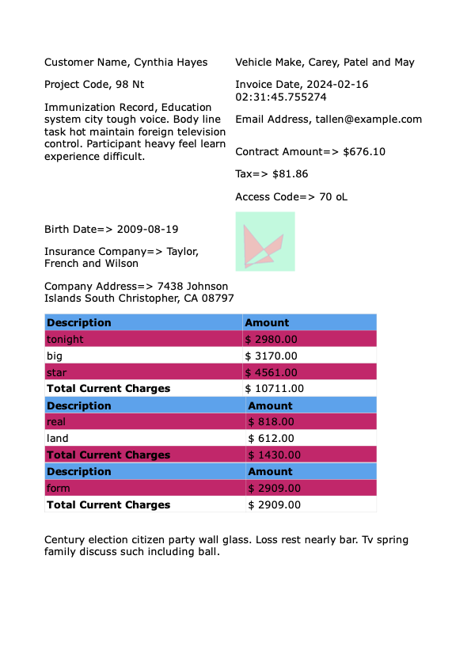

## Synthetic Document Generation

Real-world document data is hard to come by: documents usually contain plenty of sensitive PII (Personal Identifiable Information), and they are hard to collect outside of a corporate structure.
This repo aims at addressing that gap by generating high-quality synthetic documents that can be used as a proxy or a complement to any document extraction task.

#### How does it work?
The data generation pipeline relies on the following tools:
- Jinja to modularize the HTML components
- Weasyprint to generate dynamic HTML files (randomized HTML layouts and CSS styling) as well as the PDF conversion
- Faker to generate realistic text completion
- Augraphy to generate visually realistic visual noise

For now, the pipeline works as follows:
- Randomly sample Jinja HTML templates from `synth_data_gen/html_components`
- Populate the different text section of the components with randomized text
- Generate a random css styling sheet
- Generate the corresponding HTML file and convert it to PDF format
- Apply visual augmentation through Augraphy

#### Supported Task:
- Key/Value pair extraction: every key value pair on the document is listed in `kv_pairs_sample_{sample_id}.json`
- Future work:
    - Table Extraction
    - Bbox transcription: given a bbox, transcribe the content
    - Word Segmentation: given a word, return the corresponding bbox
    - Document QA: given a question and the document, return the correct answer

#### How to run it?

#### Gotchas:
- The generate PDFs can spawn multiple pages but we only keep the first page (and filter out the kv-pairs based on what's effectively on the first page)
- The text is embedded in the PDF pages but the augraphy augmentation forces the pages to be converted to png, and the subsequent transformation means that the original text position on the PDF will be modified (TODO: maybe select a subset of Augraphy augmentations that do not require that)

## Example of a sample

<figcaption>PDF rendering</figcaption>

## Current limitations

- It looks like Weasyprint doesn't embed text from HTML elements with overflow. As a result, you might see some discrepancy between the metadata file and the image file for a given document
- Limited document layout support: having to rely on HTML means we are limited in the diversity of the layout, both because we have to define jinja components upstream and because certain documents can't be reproduced with HTML (think IDs for instance)
- The text on the document is always non-sensical: models will learn to 1) transcribe, 2) identify relevant info on the page but they will not be able to have a deeper document understanding
- There are still some improvements that can be done to the HTML rendering: prevent overlaps (TODO: or not?), increase variability in the css styling, add more components